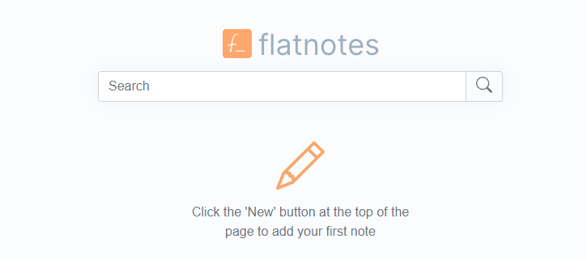

# Flatnotes CI/CD pipeline

Deploy Flatnotes server with CI/CD on Elestio

 
 

# Once deployed ...

You can can open Flatnotes UI here:

    URL: https://[CI_CD_DOMAIN]
    email:[ADMIN_EMAIL]
    password: [ADMIN_PASSWORD]
